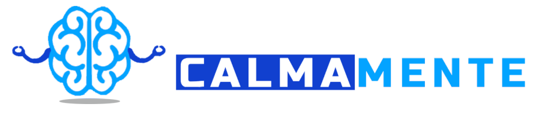

<h1 align="center">
    
</h1>
<h4 align="center"> 
	🚧 🚀 Em construção... 🚧
</h4>

  
  
  
  
  

### 🧠 Calmamente

É um projeto em parceria com a IBM - International Business Machines | Com o intuito de auxiliar os ansiosos principalmente nesse tempo de pandemia.

🚀 Conteúdos
===================

 <a href="#-sobre-o-projeto">Sobre o projeto</a> •
 <a href="#-tecnologias">Tecnologias</a> • 
 <a href="#-recursos">Recursos</a> • 
 <a href="#-quem-somos">Quem somos</a> • 
 <a href="#-missão">Missão</a> • 
 <a href="#-visão">Visão</a> • 
 <a href="#-valores">Valores</a> • 
<a href="#-contribuitors">Contribuidores</a>

### 💻 Sobre o projeto
O calmamente é uma ferramenta que visa auxiliar os usuários que possuem ansiedade, mostrando exercícios práticos e simples, mas com uma eficácia e potencial de retirar um ansioso de uma crise de ansiedade. Ou caso a pessoa sinta que está entrando em uma crise, ela poderá acessar os exercícios voltados para pré-crise.
Nossa solução utilizará de um chat-bot fornecido pela IBM - "Watson Assistant", integrado com o IBM Cloud. Este chat-bot será capaz de identificar através de uma conversa: o nível de ansiedade de uma pessoa; constatar clinicamente que ela possui o Transtorno de Ansiedade Generalizada ou não; constatar clinicamente que ela possui Síndrome do Pânico ou não; e identifica alguns gostos pessoais do usuário. Esta informação é processada e, é retornado para a aplicação web os exercícios que mais se adequam àquele usuário.
Para que assim com um layout intuitivo e ágil, a pessoa possa acessar nossos exercícios para sair de seu estado de crise, ou caso não queira entrar em um. O usuário também será capaz de se aventurar por todos os exercícios existentes em nosso sistema na aba de personalizar, onde poderá escolher qual exercício deseja fazer ou não, para que assim sua experiência seja mais satisfatória ainda.

Nosso projeto utilizará das tecnologias de React Js para o desenvolvimento da aplicação web, java como linguagem de back-end, SQL Oracle como banco de dados para o armazenamento e persistências necessárias e o Watson Assistant como fornecedor de chat-bot. Além disso todo o projeto está sendo desenvolvido em metodologia ágil: SCRUM.

### 🛠 Tecnologias

As seguintes ferramentas foram usadas na construção do projeto:

- [HTML5](https://www.devmedia.com.br/o-que-e-o-html5/25820) 
- [CSS](https://developer.mozilla.org/pt-BR/docs/Web/CSS0) 
- [Bootstrap](https://pt.wikipedia.org/wiki/Bootstrap_(framework_front-end)) 
- [Javascript](https://developer.mozilla.org/pt-BR/docs/Web/JavaScript)
- [Node.js](https://nodejs.org/en/)
- [React](https://pt-br.reactjs.org/)
- [Sql](https://www.devmedia.com.br/guia/guia-completo-de-sql/38314)
- [Java](https://pt.wikipedia.org/wiki/Java_(linguagem_de_programa%C3%A7%C3%A3o))
- [Chat-bot(Watson assistant)](https://www.ibm.com/br-pt/cloud/watson-assistant)
- [Metodologia SCRUM](https://blog.contaazul.com/metodologia-scrum)

### 👥 Quem somos

Somos um grupo de desenvolvedores que entendemos que a ansiedade no Brasil é um problema real, sério e que aumentou muito durante a pandemia. Por isso criamos o Calmamente uma plataforma digital que possa ajudar você em momentos de uma crise de ansiedade e em momentos antes de uma crise, fornecendo exercícios simples com a capacidade retirada de sua mente do estado de crise. Entendemos também que cada pessoa tem suas individualidades em momentos de crise e que devem ser respeitadas, recomendando assim exercícios de acordo com suas próprias características individuais.
### 🎖 Missão
Ajudar pessoas que possuem problemas com ansiedade sugerindo diversos exercícios de acordo com a personalidade da pessoa, e permitindo que ela personalize suas soluções. Ultimamente os casos de pessoas com ansiedade vem subindo muito e quanto mais pessoas forem ajudadas melhor.

### 👀 Visão
Pretendemos nos tornar o maior canal acessível para ajuda contra ansiedade do Brasil, sendo bem-visto e recomendado por conselhos de psicologia de todo o país. Nosso objetivo é ser capaz de ajudar milhares de pessoas todos os dias a lidarem com essa doença e contribuir para que o Brasil pare de ser, no ranking da OMS, o pais mais ansioso do Mundo.

### 👔 Valores
Humanização: Cuidado centrado nas pessoas, respeitando todos os usuários.

Compreensão: Compreendemos que a ansiedade é um problema sério e que deve ser tratada com muita atenção.

Gratidão: Somos gratos pela possibilidade de auxílio às pessoas principalmente por termos passado por momentos tão difíceis.

Confiabilidade: Estabelecer relacionamentos abertos, transparentes e apoiados na confiança mútua.

## 👥 Contribuitors
<table>
	<tr>
	      <td align="center"><a href="https://github.com/JhoctanTeixeira"> <b>Jhoctan Teixeira</b></a> <a href="https://github.com/JhoctanTeixeira" title="Jhoctan-Teixeira">🚀💻</a></td>
		<td align="center"><a href="https://github.com/enzo-b-pagliacci"> <b>enzo-b-pagliaci</b></a> <a href="https://github.com/enzo-b-pagliacci" title="enzo-b-pagliaci">🚀💻</a></td>
    		<td align="center"><a href="https://github.com/Gustavo-Lopes-Carlin-fiap"> <b>Gustavo-Lopes-Carlin-fiap</b></a> <a href="https://github.com/Gustavo-Lopes-Carlin-fiap" title="Gustavo">🚀💻</a></td>
    		<td align="center"><a href="https://github.com/Guilherme-Beck-FIAP"> <b>Guilherme-Beck-FIAP</b></a> <a href="https://github.com/Guilherme-Beck-FIAP" title="enzo-b-pagliaci">🚀💻</a></td>
    		<td align="center"><a href="https://github.com/Gabrielrpg68"> <b>Gabrielrpg68</b></a> <a href="https://github.com/Gabrielrpg68" title="enzo-b-pagliaci">🚀💻</a></td>	
	</tr>
</table>
